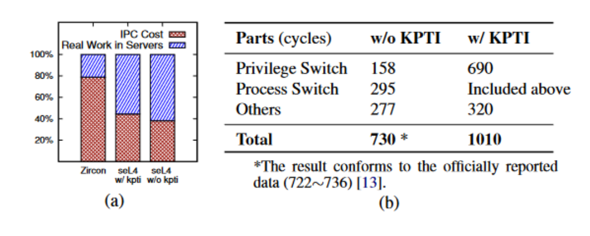
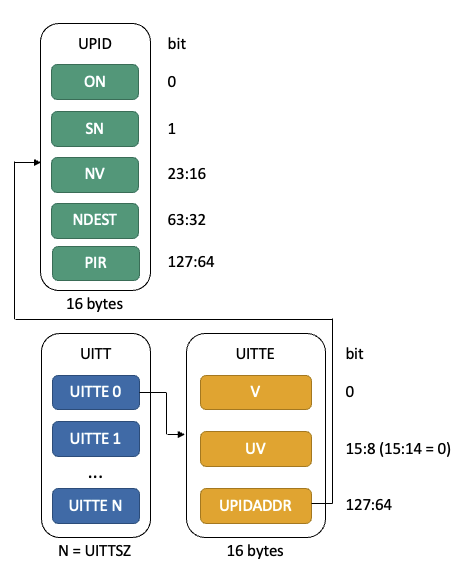
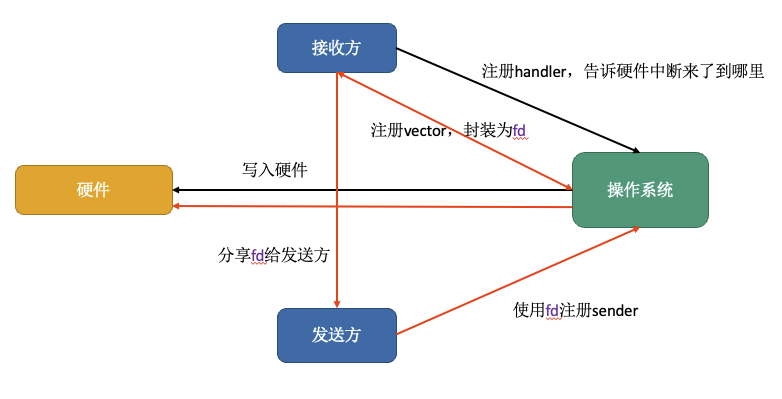
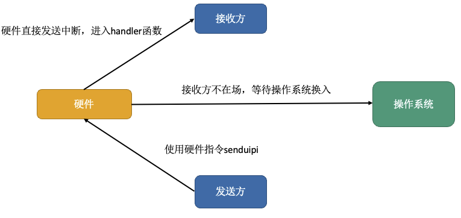
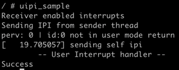
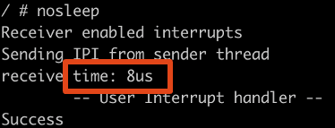
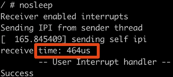
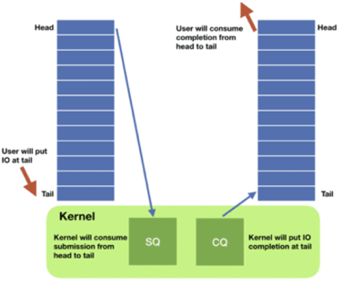
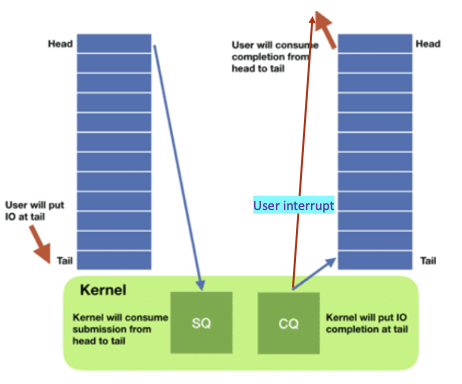
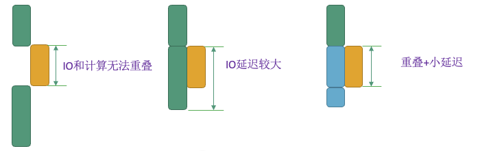

# 基于用户态中断的进程间通信以及异步IO

- [toc]

## 摘要

近年来, 微内核的影响力越来越大, 但是微内核的服务调用收到IPC性能的约束, 性能优越的解决方案(如XPC)对硬件和内核的修改成本过大。对于宏内核而言, 频繁的通过系统调用操作外设中上下文切换的开销也变得不容忽视, 而基于用户态的驱动实现又依赖轮询, 消耗cpu资源。**用户态中断( User Interrupt )**是一种新的硬件特性, 使得用户态的程序能够接受到中断, 并进入指定的中断处理函数中, 中断过程由硬件发送, 无需经过内核。本项目探索运用新一代 Intel 硬件特性用户态中断，搭建运行环境, 进行IPC的性能测试并与传统IPC方式进行比较。  我们的结果表明, 利用用户态中断来进行进程间通信, 因其不需要进过内核, 从而性能相比传统进程间通信有数量级上的优势。此外我们还通过将用户态中断和linux io_uring子系统结合, 以用户态中断作为IO完成的通知机制, 实现了双向的异步调用过程, 在保证异步基本的特性的情况下获取了更低的io延迟。


## 需求背景

### 微内核需求

#### IPC: 性能瓶颈

近年来, 微内核的影响力越来越大, 微内核的重要特征是将内核与系统服务层分离出来，如文件系统、网络、GUI等都变成用户态进程，内核只保留最重要的进程管理、内存管理、进程间通信等功能。微内核架构使得服务之间相互独立, 提供了良好的安全性, 容错性; 同时有利于各个服务的模块化和可定制化, 不必于内核一起编译。

但由于微内核的每个服务都是一个独立的进程, 从而服务的访问需要进行**进程间的通信( IPC，Inter-Process Communication )**。具体而言, 服务的请求方向操作系统提交服务请求, 操作系统再将相应的请求转交到对应的服务进程, 服务完成后再返回给服务请求方。其中涉及权级的切换, 进程的切换, 上下文的切换, 在大量服务访问的情况下这些切换的开销不可忽视。 



在上图中, 红色部分为IPC的开销, 蓝色部分真正的服务执行时间, 可见IPC的开销在一些微内核的实现情况下成为了主要的开销。而传统实现IPC的开销在几百个时钟周期到上千个时间周期不等, 是不可忽视的一部分。IPC成为微内核的性能瓶颈。

#### 现有方案:

传统的IPC依赖内核的通知, 而陷入内核需要较大的上下文切换开销, 同时如果采用内核页表隔离的技术, 会面临缓存失效带来的性能下降; 同时由于进程之间是地址空间隔离的, 如果需要传递数据, 数据的拷贝也会带来很大的开销, 可行的方案是通过共享内存的方式进行交互。

近年来学术界也有相关的研究成果, 如陈海波团队提出的XPC( Cross Process Call, ISC19), 提供了一种同步, 安全, 高效, 易用的IPC机制。主要通过新增硬件指令(xcall, xret), 由硬件直接完成进程的切换, 无需进过操作系统内核。其缺点在于对硬件和操作系统修改的成本太大。

综上所述, **对软硬件修改小, 同时可以实现高效的IPC**成为了微内核的重要需求。

### 宏内核需求

#### 外设控制

对于宏内核(如linux), 大部分的硬件驱动运行与内核态, 是内核代码的一部分。这样的设计优点在于直观, 方便用户调用而无需关心驱动的具体实现, 同时相比微内核而言, 除了系统调用的开销不需要额外IPC的开销。但是这样设计的缺点在于安全性、扩展性、可维护性均存在一定的问题。调用驱动任然需要经过统调用从而带来的上下文切换开销， 在频繁访问外设时会带来显著的性能下降。

#### 现有方案:

目前也有通过用户态的程序来控制外设的实现(如SPDK, DPDK), 其主要实现方式为通过将外设的内核驱动重新绑定到 uio 或 vfio ，用户进程可以直接访问外设的地址空间，操作外设， 省去了系统调用和 IPC 的开销。这些方案通常是基于**轮询**实现的, 而轮询对CPU的占用和消耗是比较大的, 在低密度的访问情况下会造成资源的浪费。而用户态的结局方案均采用轮询机制的一个重要原因是现有的硬件不支持将外设中断交由用户态程序处理。

综上所述, **让用户态程序能够处理中断**, 成为了高效外设控制的需求。


## 用户态中断

### 用户态中断简介

用户态中断（User Interrupt）指的是能够在用户态注册中断处理函数，并且也能够在用户态触发指定的中断处理函数。

RISC-V于2020年11月, 提出了[N指令扩展规范](https://five-embeddev.com/riscv-isa-manual/latest/n.html) 其中就有支持用户态中断的设计。Intel于2021年5月发布的[软件开发指南](https://www.intel.com/content/dam/develop/external/us/en/documents/architecture-instruction-set-extensions-programming-reference.pdf)中表述了x86架构下用户态中断的实现以及特性, 这也是本项目采用的平台。

用户态中断有低延迟, 地CPU占用的特点, 中断的接收和发送无需经过操作系统内核。同时用户态中断的发送方可以是用户态的程序, 也可以是内核。对于支持用户态中断的程序, 硬件是商业化的硬件, 对操作系统的修改也只是增量的添加系统调用。

用户态的以上特性满足了微内核对于在低修改成本的情况下获得高IPC性能的需求, 同时也满足宏内核对于内核能够发送中断到用户态的需求。

### x86用户态中断的实现和原理

本小节适当地介绍x86用户态中断的总体实现, 主要通硬件, 操作系统, 用户程序三个方面介绍用户态中断的运作方式, 如果需要更详细的硬件特性说明, 请参考[intel sdm](https://www.intel.com/content/dam/develop/external/us/en/documents/architecture-instruction-set-extensions-programming-reference.pdf)。如果希望更多操作系统相关的实现, 可以参考对应的[man page](https://github.com/OS-F-4/uintr-linux-kernel/tree/uintr-next/tools/uintr/manpages)。

#### 用户程序

接受方需要注册中断处理函数, 同时分配中断向量给发送方, 控制中断的使能(stui)。发送方需要经过系统调用注册, 随后使用`senduipi`指令发送中断。

我们通过一个最简单的样例程序和注释来介绍其工作的机制。

```c
unsigned int uintr_received, uintr_fd;
void __attribute__ ((interrupt)) uintr_handler(struct __uintr_frame *ui_frame,
					       unsigned long long vector){ // 用户态中断处理函数, 功能为将uintr_received置1
	uintr_received = 1;
}

void *sender_thread(void *arg){ // 发送方线程执行的函数
	int uipi_index = uintr_register_sender(uintr_fd, 0);// 注册sender
	_senduipi(uipi_index); // 通过senduipi发送中断
	uintr_unregister_sender(uintr_fd, 0);// 注销sender
	return NULL;
}

int main(int argc, char *argv[])
{
	pthread_t pt;
	uintr_register_handler(uintr_handler, 0) // 注册handler
	uintr_fd = uintr_create_fd(0, 0); // 接收方创建链接, 给发送方调用

	_stui(); // 使能中断
	//创建线程调用发送函数
	pthread_create(&pt, NULL, &sender_thread, NULL)

	/* 进入循环, 等待中断 */
	while (!uintr_received)
		usleep(1);
	// 收尾工作
	pthread_join(pt, NULL); close(uintr_fd);
	uintr_unregister_handler(0);
	printf("Success\n"); exit(EXIT_SUCCESS);
}

// 如果没有用户态中断将uintr_received置为1, 整个程序将陷入死循环, 而由于用户态中断, 程序收到中断后可以进入中断处理函数, 随后将uintr_received置为1, 退出死循环, 正常退出程序。
```


#### 操作系统

操作系统主要的修改为增加系统调用, 为接受方维护UPID(User Posted Interrupt Descriptor), 为发送方维护UITT(User Interrupt Target Table)。

系统调用列表:

| 名称                     | 功能                                                         |
| ------------------------ | ------------------------------------------------------------ |
| uintr_register_handler   | 用于用户态中断的接收方注册中断处理函数, 操作系统会将中断处理函数的地址写入硬件, 从而使得接收到中断后可以跳转到指定的函数入口进行执行。 |
| uintr_unregister_handler | 注销中断处理函数, 注销后硬件将不在记录中断处理函数地址, 接受方也无法收到中断。 |
| uintr_create_fd          | 用于接收方创建链接, 接收方向操作系统注册设定的中断向量`vector`, 所有的注册信息将被操作系统封装为一个文件描述符,  用于后续给发送方注册`sender`。注册成功后, 发送方若发送中断, 则收到的中断函数中的参数会携带中断向量`vector`, 从而接收方可以区分不同的发送方。 |
| uintr_register_sender    | 用于发送发注册`sender`, 向操作系统提供的是接收方所注册的文件描述符, 操作系统根据注册的文件描述符来为发送方写入接受方的相关信息, 同时返回接受方信息在`UITT(User Interrupt Target Table)`中的下标, 发送方可以通过下标来给不同的接受方发送用户态中断。 |
| uintr_unregister_sender  | 注销用户态中断的发送方, 注销后对应的下标将无法成功发送中断。 |

接下来简要介绍一下操作系统维护的两种数据结构:



- UPID(User Posted Interrupt Descriptor)

UPID是操作系统为用户态中断接收方维护的数据结构, 主要标志了使能, 中断向量等位。

| 区块  | 含义                                                     |
| ----- | -------------------------------------------------------- |
| ON    | 标志当前是否有中断                                       |
| SN    | 中断使能状态                                             |
| NV    | 中断编号                                                 |
| NDEST | 标志接受方所在的物理核号, 硬件在发送时会根据核号发送中断 |
| PIR   | 中断向量, 标志当前哪个或者哪几个发送方发送了用户态中断   |

- UITT(User Interrupt Target Table)

UITT是操作系统为中断发送方维护的数据结构, 为一张表, 表中的一项为UITTE的指针, 指向UITTE结构体, UITTE中主要标记了发送UPID的地址以及使能以及当前发送方持有的中断向量。

| 区块     | 含义                                               |
| -------- | -------------------------------------------------- |
| V        | 合法位                                             |
| UV       | 发送方持有的中断向量, 最后接受方的第1<<UV位会置为1 |
| UPIDADDR | 接受方UPID的基地址                                 |

 


#### 硬件

硬件主要的修改为增加若干寄存器以及新的指令。

新增的硬件指令以及简介: 

| 指令名称       | 作用                                                 |
| -------------- | ---------------------------------------------------- |
| senduipi index | 给当前用户中断                                       |
| stui           | 使能用户态中断, 此后用户可以收到用用户态中断         |
| clui           | 清除中断, 此后无法收到用户态中断                     |
| uiret          | 用于从用户态中断处理函数中返回到之前的上下文继续执行 |
| testui         | 测试当前用户态中断的状态                             |

新增寄存器:

| 寄存器名称        | 作用                                                         |
| ----------------- | ------------------------------------------------------------ |
| UINTR_RR          | 标记当前是哪个发送方发来的中断, 以及是否有中断               |
| UINTR_HANDLER     | 记录中断处理函数的地址                                       |
| UINTR_STACKADJUST | 进入中断处理函数后, 需要的栈偏移量                           |
| UINTR_MISC        | 记录了中断编号, UITT的大小,                                  |
| UINTR_PD          | 记录User Posted Interrupt Descriptor的基地址, 作为接收方时硬件会调用 |
| UINTR_TT          | 记录User Interrupt Target Table的基地址, 作为发送方硬件会调用 |


### 中断建立和发送概览

- 中断的建立




- 中断的发送




### 基于qemu的实现

为了能够更好的进行内核以及用户程序的调试, 我们基于qemu实现了x86架构下对用户态中断的支持, 成功运行了支持用户态中断的操作系统以及应用程序(下图为在系统中成功运行uipi_sample的截图)。据我们了解，这可能第一个基于qemu的x86 uintr实现。



目前qemu通过新增硬件寄存器, 新增指令支持, 新增中断处理支持, 直接发中断支持等方式实现了对用户态中断的支持, 并在收发延迟中相比传统方法(经过操作系统)有数十倍的性能的提升, 这也印证了我们在qemu中对硬件模拟的实现的有效性。

下图为性能对比图, 我们在qemu中进行计时, 计时的开始节点是`senduipi`这条指令执行开始, 到硬件收到对应的中断结束。其中带数字的是内核输出。我们可以看到, 如果没有进入内核, 完全由硬件发送中断, 只需要8us, 而如果中断发送过程中如果由于调度或者其他原因经过内核, 中断的收发延迟就会大大增加, 有数十倍的差距。



我们总体的开发过程如下, 具体的问题解决过程以及解决方式详见[**探究过程**](https://github.com/OS-F-4/usr-intr/blob/main/ppt/qemu%E5%B7%A5%E4%BD%9C%E6%96%87%E6%A1%A3%E5%88%86%E5%9D%97/%E9%97%AE%E9%A2%98%E4%BB%A5%E5%8F%8A%E6%8E%A2%E7%A9%B6%E8%BF%87%E7%A8%8B.md), 其中有**上万字的详细的开发过程**中的困难以及解决方式。

1. 环境准备
2. 指令捕捉，向软件反馈硬件特性
3. 内存读写实现发送
4. 修改中断处理实现接收
5. 中断收尾实现完整运行
6. 实现直接发中断，提高性能
7. 多次调试，完善实现细节

我们的代码位于https://github.com/OS-F-4/qemu-uintr。

在编写的过中, 我们将遇到的问题和检索的信息进行提炼, 总结成**[qemu tutorial](https://github.com/OS-F-4/qemu-tutorial),** 方便更多的人从源代码去理解qemu的运行机制, 修改qemu。


## 基于用户态中断的进程间通信

我们利用用户态中断来编写程序, 实现程序之间的IPC通信, 同时希望和传统的IPC方式作比较。我们在qemu和物理机上均做了测试, 实验结果表明, 使用用户态中断进行进程间通信在性能上和传统IPC有量级上的优势。

### 实验设定

给定两个进程, 互相通过某种IPC机制完成固定数量的IPC, 每次IPC携带一定量的数据, 比较完成所有IPC的时长, 测试平均每秒能够发送的IPC次数。

### 性能结果

基于qemu运行结果:

| IPC type        | Message rate  (msg/s, size = 1) | Message rate  (msg/s, size = 4096) |
| --------------- | ------------------------------- | ---------------------------------- |
| uintr (thread)  | 28935                           | 23305                              |
| uintr (process) | 34392                           | 22662                              |
| signal          | 6286                            | N/A                                |
| eventfd         | 6649                            | N/A                                |
| pipe            | 2858                            | 2256                               |
| fifo            | 2782                            | 2674                               |
| domain          | 4835                            | 2781                               |

基于物理机器运行结果:

| IPC type        | Message rate  (msg/s, size = 1) | Message rate  (msg/s, size = 4096) |
| --------------- | ------------------------------- | ---------------------------------- |
| uintr (thread)  | 191868                          | 116340                             |
| uintr (process) | 377670                          | 347037                             |
| signal          | 31798                           | N/A                                |
| eventfd         | 26630                           | N/A                                |
| pipe            | 9436                            | 14011                              |
| fifo            | 25544                           | 16527                              |
| domain          | 11183                           | 19758                              |


其中`uintr(thread)`是两个之间利用用户态中断相互通通信, `uintr(process)`是两个进程之间利用用户态中断通信, 其他方法是一些经典的IPC方法例如pipe(管道), signal(信号)。

从结果可以看到, 利用用户态中断进行进程间通信相比传统方法有**量级上的性能优势**, 无论在屋里机器上还是qemu环境中。

对比qemu和物理机的数据, 同样条件下, qemu的运行速度慢于物理机, 这符合模拟器运行速度慢的直觉。相同执行环境中不同方法之间的相对差距幅度也比较相似, 这也说明了qemu对硬件的性质的模拟是比较到位的, 同时也验证了我们在qemu中实现的用户态中断支持是有效且到位的。

我们的[代码](https://github.com/OS-F-4/ipc-bench/tree/linux-rfc-v1)和[文档](https://github.com/OS-F-4/usr-intr/blob/main/ppt/%E5%B1%95%E7%A4%BA%E6%96%87%E6%A1%A3/ipc-bench.md)在对应的链接中。


## 基于用户态中断的异步IO

### 系统调用和进程间通信关系的思考

在前文中我们已经证实了用户态中断在IPC中的高效性, 我们期望用户态中断在别的地方也有用武之地。

用户态中断为IPC提供了双向的通知机制, 实现了进程间通信。如果将操作系统内核抽象为一个广义的进程(在内核页表隔离的情况下, 内核表现的更像进程), 则用户程序和内核之间的交互也可以理解为进程间通信。用户程序和内核之间的交互(系统调用), 是用户同步触发的(通过syscall硬件指令), 而这种触发类似于中断, 当前的控制流会切换进入到内核的中断处理入口。系统调用与IPC的不同之处在于, IPC的双向的, 而基于用户态中断的IPC是双向且异步的; 而系统调用是单向的, 用户使用系统调用由用户决定, 但是系统调用的返回是由操作系统决定, 并且用户程序一般会被阻塞。如果内核能够利用用户态中断作为通知机制作为系统调用的返回, 这会使得编写更高效且延时更短的异步程序。

接下来我们会介绍异步编程的需求以及分类, 适当介绍较为新颖的linux io_uring异步IO子系统, 介绍我们将用户态中断和io_uring结合的工作, 并分析实验的结果。

### 异步编程简介

#### 异步的需求和本质

随着互联网上数据量的不断增大, 用户量不断增多, web服务的不断多样化, 如何让高并发且IO密集的程序更高效的工作变得格外重要。经典的阻塞IO或者系统调用显然不能满足对性能的需求。

纯粹的同步并行并不能处理海量的数据, 原因在于一个系统能够运行的线程总数总是小于海量的网络请求, 并且如果所有的线程都因为IO而被阻塞, 则当前没有可以调度的线程, CPU处于空转状态, 而额外的网络请求也不能受到处理。此外过多的线程会导致过多的内存占用, 同时线程切换的开销会很大, 影响程序的性能。

而异步的编程方式能够使得线程不被IO阻塞, 当等待IO时线程依然可以利用CPU进行其他任务的处理, 从而提高了CPU的有效利用率, 提高总体的吞吐量, 获得更高的性能。

综上所述, 异步编程的优势在于线程不会被IO阻塞, 这样就使得CPU任务和非CPU任务相互分离, 从而更好地提高CPU和其他设备的利用率。

#### 简单的同步/异步实现分类

我们按照IO的实现方式, 使用的方便性和性能对IO的实现进行简单的分类, 从上到下, 接口的易用性会变差, 但性能会更好。

1. 同步阻塞：例如 read，阻塞当前线程直到读取完成。
2. 同步非阻塞：例如 read(NONBLOCK) ，如果当前读尚未就绪则立即返回。
3. 多路复用：例如 select,poll,epoll，阻塞当前线程直到给定事件中的任何一个发生。常配合同步非阻塞接口使用。
4. 异步：例如 MPI_iread，发出读请求，返回一个 token。之后可以查询请求状态（轮询）或者用 wait 接口阻塞等待操作完成。
5. 循环队列：例如 io_uring 及硬件设备，背后有一个内核线程（或硬件上的处理器）同时处理 IO 操作，二者通过共享内存中的两个循环队列（请求队列和完成队列）传递请求状态。

以上非阻塞/异步的特征: 异步地提交请求, 但是完成请求后的操作仍然需要在程序的特定节点调用相关的函数来**获取请求的完成情况**。延迟由请求完成本身的耗时和查询请求完成情况的频率共同决定。而我们的工作就是利用用户态中断作为提醒机制, 无需用户程序查询请求的完成状况, 从而达到更短的延迟。

### io_uring异步框架简介

我们的工作基于linux io_uring子系统, 由于该系统较为新, 我们适当介绍其工作原理。



io_uring子系统可以简单的抽象为生产者消费者模型。其中有两个重要的队列, 一个为提交队列(SQ), 提交队列中每个项简称为SQE, 其中主要标记了IO的类型(如read, write), 对应系统调用的参数, 以及用户额外添加的用户数据(一般是一个指针)。一个为完成队列(CQ), 完成队列中的每个项简称CQE, 主要包含请求的返回值(是否正常完成), 以及用户刚开始传入的用户数据(SQE中的用户数据)。两个队列一般通过共享内存的方式在内核与用户空间中共享。

对于IO的提交, 用户程序是生产者, 生产IO的请求;  内核是消费者, 完成用户程序提交的IO。用户程序只需要将IO提交到提交队列, 随后就可以进行其他任务, 最后通过检查完成队列的情况来获取IO的完成情况。

对于IO的结果返回, 内核是生产者, 将完成的IO放入完成队列; 用户程序是消费者, 检查完成队列, 并取出完成结果。

io_uring是一个高效的异步框架, 用户提交IO后可以直接执行其他任务, 同时也可以一次性提交多个IO任务, 只进行一次系统调用通知内核执行; 同时io_uring支持请求类型非常丰富, 覆盖网络和读写等, 比专门的异步框架(如AIO只支持磁盘读写)有更高的灵活性; 此外还支持开启内核线程轮询等多种模式, 最大化框架带来的效率提升。

io_uring只提供了三个系统调用, 却囊括了非常复杂的功能, 所以在系统调用的使用上会给用户带来一定的困难, 所以开发者还开发了liburing, 对系统调用进行了封装, 更方便用户的使用。

更多介绍详见[链接](https://arthurchiao.art/blog/intro-to-io-uring-zh/), 以及[man page](https://man.archlinux.org/man/io_uring.7.en)。


### 用户态中断+io_uring实现

在实现方面, 对于内核的修改在于, 在初始化io_ring时, 用户可以传递注册好的fd给内核, 使得内核获得接受方的必要信息, 并将信息记录在io_uring的上下文结构体中。在IO完成, 内核将CQE方如完成队列时, 给用户态的程序发送用户态中断进行提醒。



对于用户程序或者共享库, 一方面我们对liburing进行修改以适配我们对内核的修改, 同时在用户程序使用方面, 需要将注册好的fd传入给内核, 一本是在io_uring初始化时进行传递; 同时用户程序需要设置中断处理函数, 在内核通知到达时及时查看IO的完成状态并进行对应的操作。

整个系统达到双向的异步, 实现了从操作系统->用户程序方向从无异步通知到有异步通知的**从无到有**的突破。

我们的[内核代码](https://github.com/OS-F-4/uintr-linux-kernel/tree/uring)和[用户程序](https://github.com/OS-F-4/uring)均位于仓库中。我们进行了测试实验, 结果表明我们的实现在IO计算重叠以及IO延迟方面表现出色。

### 实验设定和方法

我们的实验采用如下的设定, 我们将程序的任务抽象为IO任务和计算任务, 这样的抽象符合绝大多数程序的设定。

1. 给定一定量的io任务(read)和计算任务
2. 计算任务大小随机(固定的随机序列, 700k~7000k次乘法)
3. IO任务分为4kB, 4MB, 40MB三种, 随机交替
4. 不涉及并行, IO只能顺序提交
5. 评价指标: 完成所有任务的总时长, 每类io的延迟

我们采用三种方法进行实验, 分别是

1. 普通的同步IO方式, 仅使用同步的系统调用完成IO。
2. io_uring + SQPOL, 用户程序异步提交IO请求到请求队列, IO完成后会由内核放入完成队列, 用户程序需要调用接口检查完成队列的完成情况。 
3. io_uring + SQPOLL + uintr, 用户程序异步提交IO到请求队列, IO完成后由内核放入完成队列, 同时利用用户态中断的机制进行提醒, 用户程序无需显示调用相关的接口, 只需要在中断处理函数中处理完成的IO即可。

按照我们的设定, 我们预期使io_uring的方案会有更短的完成所有任务的时间(因为可以利用异步使得计算和IO重叠), 同时预期同步的方式会有最短的IO延迟。而io_uring + 用户态中断的实现方式既能利用IO和计算的重叠提高总体的速度, 同时又能利用用户态中断的提醒机制达到短的延迟。



上图, 从左到右分别为同步IO( 后简称norma l), 使用io_uring( 后简称uring ), 使用io_uring+用户态中断( 后简称uintr )。从图中可以看出, normal方式由于IO完成立即返回, IO的延迟较小, 但无法将IO和计算重叠; uring的方式能够利用计算和IO的重叠, 但是如果IO先于计算完成, 但是程序仍然在执行计算任务, 只有等当期计算任务完成后才能调用相关的接口检查IO的完成情况, 所以可能会带来大的IO延迟。uintr的实现方式利用了io_uring从而将计算和IO重叠, 同时利用用户态中断的通知机制能够无条件打破计算的执行从而先处理IO的完成, 达到了小的IO延迟。

### 实验结果

在200个IO任务和1000计算任务的情况下获得如下结果(延时为所用同类延时相加, 单位为us):

其中单纯的计算用时约为3410806us。

| 方法   | 总用时(us) | 4K 延时 | 4M 延时 | 40M 延时 |
| ------ | ---------- | ------- | ------- | -------- |
| normal | 4163422    | 259     | 38753   | 698487   |
| uring  | 3546226    | 205714  | 269079  | 1283943  |
| uintr  | 3591993    | 360     | 41431   | 727977   |

以4MB的IO为例, 我们统计了最大和最小的延时的情况:

| 方法   | 4M min | 4M max |
| ------ | ------ | ------ |
| normal | 329    | 3090   |
| uring  | 707    | 10601  |
| uintr  | 330    | 3580   |

从实验结果可以看出实验符合我们的预期, normal有最长的完成时间, 但是有最短的IO延时, uring的完成时间最短, 但是IO的延迟较大, 并且延时的方差更大。uintr的方法在保证计算和IO重叠的情况下同时拥有较低的IO延迟, 并且和同步方法延迟相差不大, 在两个评价指标上有优秀的表现。


## 讨论

在我们的实验中, 用户态中断表现出了惊人的性能, 其独特的通知特性也使得在一些方面可以实现新的实现方式上的突破。除了进程间通信以及异步IO, 还有更多的领域可以使用用户态中断, 如用户态外设控制, 利用用户态中断进行程序的检测和控制等等。 除了以上的优势, 用户态中断也存在些许不足之处。第一, 建立的链接数量有限, 硬件的中断向量位数只有64位, 接受方在当前的实现下只能区分64个不同的发送方, 这在一些情况下显然是不能满足需求的, 这个问题或许可以通过软件的方式进行解决; 第二,  用户态中断只是提醒机制, 且不方便使用, 用户态中断是指通过中断进行提醒,  中断函数中的内容需要由用户定义, 同时数据的传递也需要额外的方式进行处理, 如何让用户态中断更加易用, 编写更加方便和标准的接口也是值得探索的方向。

## 结论

在本项目中, 我们实现了支持用户态中断的qemu, 探索了x86用户态中断在进程间通信以及异步IO中的妙用, 我们的结果表明利用用户态进行进程间通行与传统的进程间通信有量级上的性能优势, 在异步IO的应用中作为通知机制能够有效降低IO的延迟。对于用户态中断这样的新特性, 仍然还有许多应用的探索空间。

## 感想

项晨东: 本项目从2022年2月开始, 历时半年多, 期间因为上海疫情的原因我们团队无法接触到物理机, 从而着手开始开发qemu, 在qemu的开发过程中, 从硬件-操作系统-软件全流程的调试让我有了很多的收获, 对软硬件协同配合的方式有了更深刻的理解, 有了更好的成长。在后续探索uintr新的应用场景如异步IO框架中, 我也更加充分理解了异步的需求和实现。在尝试在物理机器上运行内核的过程中也遇到了很多困难, 但都意义克服了, 看到最后性能实验结果时我的内心是十分激动的, 感觉长期以来的努力没有白费。

## 致谢

感谢陈渝老师和向勇老师的指导！

感谢校外导师提供的帮助和硬件支持!

感谢贾越凯、贺鲲鹏、尤予阳、张译仁以及其他学长的帮助！